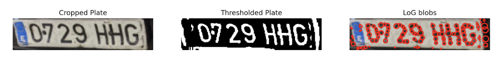

# Automatic-License-Plate-Recognition

This project focuses on **Automatic License Plate Recognition (ALPR)**, a computer vision task aimed at detecting and recognizing license plates from images or video. The goal of this project is not only to implement an ALPR system but also to **explore and analyze each step of the pipeline** to gain insights into the challenges and techniques involved. 



---

### Installation and Setup

#### 1. Environment
This project requires Python 3.x and specific dependencies. We recommend using Conda or a virtual environment.

First, clone the repository:

```bash
git clone [https://github.com/your-username/Automatic-License-Plate-Recognition.git](https://github.com/your-username/Automatic-License-Plate-Recognition.git)
cd Automatic-License-Plate-Recognition
```

The required dependencies are specified in environment.yml. Create and activate the environment:

```bash
conda env create -f environment.yml
conda activate alpr-env
```
---

### Repository Structure

The **key directories** in this repository are the following (corresponding to the different steps followed in our ALPR pipeline):

- `DataExploration/`: First step of our pipeline, contains the scripts used for analyzing the datasets (e.g., illuminance values and camera angle distribution on images).

- `Detection_YOLO/`: Contains the scripts for object and license plate detection using both YOLOv8 and the public LP-Detector (MKgoud/License-Plate-Detector) model. All together with exploration on the performance of both models and comparison between their results. 

- `CharacterSegmentation/`: Custom scripts and logic for segmenting the detected license plate image into individual characters. Involves correcting distortions on detected license plates, performing character detection using contour- and blob-based methods, as well as applying thresholding and watershed segmentation in order to extract character regions.

- `Descriptors`: work in progress


